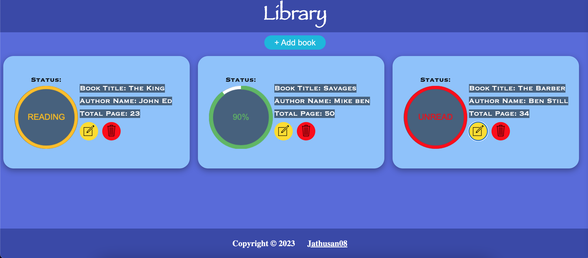

# Library Management System

## Introduction

This is part of Odin Project and I have built a simple Library Management System web application using HTML, CSS, and JavaScript. It allows users to manage their book collection, including adding new books, updating book details, and removing books.

## Features

- **Add Book:** Users can add new books to their collection by providing details such as title, author, number of pages, and reading status.
- **Update Book:** Users can edit the details of existing books, including the title, author, pages, and reading status.
- **Delete Book:** Users can remove books from their collection.
- **Reading Status:** Books can be marked as "Unread," "Reading," "Completed," or users can specify a custom reading status by entering the number of pages read.

## How to Use

1. **Add a Book:**

   - Click the "+ Add book" button to open a dialog where you can enter the details of the new book.

2. **Edit a Book:**

   - Click the edit button (pencil icon) next to a book to modify its details. This will open the same dialog as adding a new book, but with the existing details pre-filled.

3. **Delete a Book:**

   - Click the delete button (trash icon) next to a book to remove it from your collection.

4. **View Book Details:**
   - Each book is displayed in a grid format, showing the title, author, total pages, and a circular progress bar indicating the reading status.

## Customisation

You can easily customize the styling of the application by modifying the `style.css` file. Feel free to update colors, fonts, or layout to suit your preferences.

## Dependencies

- **Icons:** The application uses icons from [icons8](https://icons8.com/).

## Getting Started

To get started with the game in your web browser, follow these instructions:

## Prerequisites

You need a modern web browser that supports HTML and CSS.

## Installation

Clone this repository to your local machine or download the ZIP file and extract it to a local folder. Open the index.html file in your web browser.

## Credits

This project is created by [Jathusan08](https://github.com/Jathusan08). If you have any questions or suggestions, feel free to open an issue.

## License

This project is licensed under the [MIT License](LICENSE). Feel free to use, modify, and distribute the code.
